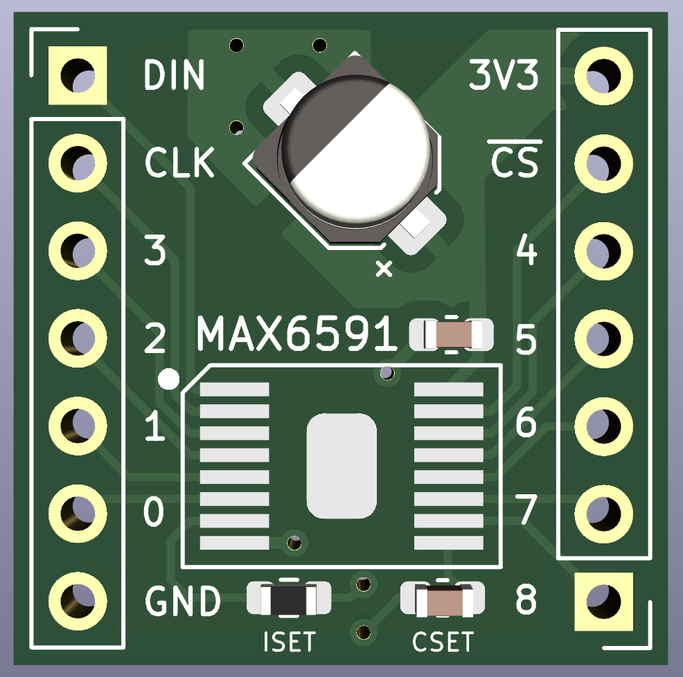

# MAX6950/6951 Breakout
## 5- and 8-digit LED display drivers

A board for mounting [MAX6950 and
MAX6951](https://www.digikey.com/en/products/detail/inolux/IN-PI554FCH/7604874)
LED display drivers.

Note that this chip has a thermal relief slug on the underside.

